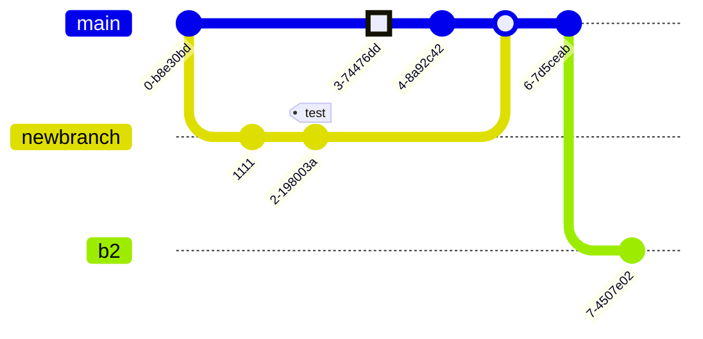

### Why ORM?


**'Object-Relational Impedance Mismatch'** (sometimes called the 'Paradigm Mismatch') is just a fancy way of saying that object models and relational models do not work very well together.

Other ORM - Enterprise JavaBeans Entity Beans, Java Data Objects, Castor, TopLink, Spring DAO, Hibernate etc.

Consider below objects need to be stored and retrieved into the following RDBMS table:
-	1st problem, what if we need to modify the design of our database after having developed few pages or our application?
-	2nd problem, Loading and storing objects in a relational database exposes us to the following five mismatch problems.




```java
public class Employee {
   private int id;
   private String first_name; 
   private String last_name;   
   private int salary; 
   public Employee() {}
   // getter-setters
}
```
```sql
create table EMPLOYEE (
   id INT NOT NULL auto_increment,
   first_name VARCHAR(20) default NULL,
   last_name  VARCHAR(20) default NULL,
   salary     INT  default NULL,
   PRIMARY KEY (id)
);
```

RDBMS represent data in a tabular format, whereas object-oriented languages, such as Java, represent it as an interconnected graph of objects. Loading and storing graphs of objects using a tabular relational database exposes us to **5 mismatch problems**.

### Problems ORM Solves

#### 1. Granularity
- Sometimes you will have an object model which has more classes than the number of corresponding tables in the database (Object model is more granular than the relational model). Take for example the notion of an Address.
- The greater the granularity, the deeper the level of detail. Granularity is usually used to characterize the scale or level of detail in a set of data.

#### 2. Subtypes (inheritance)
Inheritance is a natural paradigm in object-oriented programming languages. However, RDBMSs do not define anything similar.

#### 3. Identity
A RDBMS defines exactly one notion of 'sameness': the primary key. Java, however, defines both object identity a==b and object equality a.equals(b).

#### 4. Associations
-	OOP associations - using references 
-	RDBMS associations - foreign key column.
-	If you need bidirectional relationships in Java, you must define the association twice. Likewise, you cannot determine the multiplicity of a relationship by looking at the object domain model.

#### 5. Data navigation
-	The way you access data in Java is fundamentally different than the way you do it in a relational database. 
-	In Java, you navigate from one association to another walking the object network. This is not an efficient way of retrieving data from a relational database. You typically want to minimize the number of SQL queries and thus load several entities via JOINs and select the targeted entities before you start walking the object network.

## Hibernate vs JDBC

### JDBC
-	DB specific
-	need to know SQL
-	query tuning is to be done by the database authors.
-	java cache is to be implemented
-	Developer writes code for mapping Object to DB schema 
-	only native Structured Query Language (SQL)
-	all exceptions are checked exceptions, we must write code in try, catch and throws
-	will rises an error like "View not exist"

### Hibernate
-	code will work well for all databases (Oracle, MySQL etc)
-	wrapper over JDBC API or some other api. (Dialects)
-	It provided Dialect classes, so we no need to write sql queries in hibernate, instead we use the methods provided by that API.
-	No knowledge of SQL is needed as table is treated as an object
-	Query tuning is not required in Hibernate, automatic in hibernate by using criteria queries.
-	support for cache of hibernate for better performance.
-	improves performance during multiple writes for the same data.
-	itself takes care of this mapping using mapping files so developer does not need to write code for this.
-	provides Hibernate Query Language (HQL) which is similar to SQL syntax and supports polymorphic queries too. It is DB independent
-	supports Inheritance, Associations, Collections
-	if we save the derived class object,  then its base class object will also be stored into the database, it means hibernate supporting inheritance.
-	supports relationships like One-To-Many,One-To-One, Many-To-Many-to-Many, Many-To-One
-	supports collections like List,Set,Map (Only new collections)
-	we only have Un-checked exceptions, so no need to write try, catch, or no need to write throws.  Actually in hibernate we have the translator which converts checked to Un-checked.
-	has capability to generate primary keys automatically while we are storing the records into database
-	if any table not found in the database, it will create the table for us.
-	supports annotations, apart from XML.
-	Getting pagination in hibernate is quite simple
-	Handling DataTypes Boolean <--> Y_N. @Type(type="Yes_No")

### Advantages
-	Lets business code access objects rather than DB tables.
-	Hides details of SQL queries from OO logic.
-	Based on JDBC 'under the hood'
-	No need to deal with the database implementation.
-	Entities based on business concepts rather than database structure.
-	Transaction management and automatic key generation.
-	Fast development of application.

What are the advantages of Hibernate over JDBC?
Some of the important advantages of Hibernate framework over JDBC are:
-	Hibernate removes a lot of boiler-plate code that comes with JDBC API, the code looks more cleaner and readable.
-	Hibernate supports inheritance, associations and collections. These features are not present with JDBC API.
-	Hibernate implicitly provides transaction management, in fact most of the queries can’t be executed outside transaction. In JDBC API, we need to write code for transaction management using commit and rollback. Read more at JDBC Transaction Management.
-	JDBC API throws SQLException that is a checked exception, so we need to write a lot of try-catch block code. Most of the times it’s redundant in every JDBC call and used for transaction management. Hibernate wraps JDBC exceptions and throw JDBCException or HibernateException un-checked exception, so we don’t need to write code to handle it. Hibernate built-in transaction management removes the usage of try-catch blocks.
-	Hibernate Query Language (HQL) is more object oriented and close to java programming language. For JDBC, we need to write native sql queries.
-	Hibernate supports caching that is better for performance, JDBC queries are not cached hence performance is low.
-	Hibernate provide option through which we can create database tables too, for JDBC tables must exist in the database.
-	Hibernate configuration helps us in using JDBC like connection as well as JNDI DataSource for connection pool. This is very important feature in enterprise application and completely missing in JDBC API.
-	Hibernate supports JPA annotations, so code is independent of implementation and easily replaceable with other ORM tools. JDBC code is very tightly coupled with the application.

**Performance**  
The problem is the startup performance. When hibernate loads, it analyzes all entities and does a lot of pre-caching - it can take about 5-10-15 seconds for a not very big application. So, your 1 second unit test is going to take 11 secods now. Not fun.

**In-memory Session**  
For every transaction, hibernate will store an object in memory for every database row it "touches". For lots of objects, it can seriously affect performance, unless you explicitly and carefully clean up the in-memory session on your own.

**Cascades**  
Cascades allow you to simplify working with object graphs. Example, if you save root object, you can configure hibernate to save children as well. The problem starts when your object graph grows complex. 

**Lazy Loading**  
Lazy Loading means that every time you load an object, hibernate will not load all it's related objects but instead will provide place holders which will be resolved as soon as you try to access them. This behaviour otherwise you will get cryptic errors, "LazyInitializationException". Depending on the order of how you load your objects and your object graph you may hit **"n+1 selects problem"**. 

**Schema Upgrades**  
Hibernate allows easy schema changes by just refactoring java code and restarting. It's great when you start. But then you release version one. And unless you want to lose your customers you need to provide them schema upgrade scripts. Which means no more simple refactoring as all schema changes must be done in SQL.

**Views and Stored Procedures**  
Hibernate requires exclusive write access to the data it works with. Which means you can't really use views, stored procedures and triggers as those can cause changes to data with hibernate not aware of them. You can have some external processes writing data to the database in a separate transaction. But if you do, your cache will have invalid data. This is one more thing to care about.

**Single Threaded Sessions**  
Hibernate sessions are single threaded. Any object loaded through a session can only be accessed (including reading) from the same thread. This is acceptable for server-side applications but might complicate things unnecessary if you are doing GUI based application.

**What is Java Persistence API (JPA)?**  
Java Persistence API (JPA) provides specification for managing the relational data in applications. JPA specification is defined with annotations in javax.persistence package. Using JPA annotation helps us in writing implementation independent code.

**Saving Without Hibernate**
-	JDBC DB Configuration – ip, port, user, password
-	Write Model Object
-	Service method to create model object
-	DB Design - Table and mappings
-   DAO method to save using SQL query.

**Saving with Hibernate**
-	JDBC DB config – hibernate config
-	Model Object – Annotations
-	Service method to create model object – use hibernate api rather than jdbc save,
-	DB Design -not needed 😊
-	DAO method to save the object using SQL query - Not needed (All boilerplate mapping stuff)
